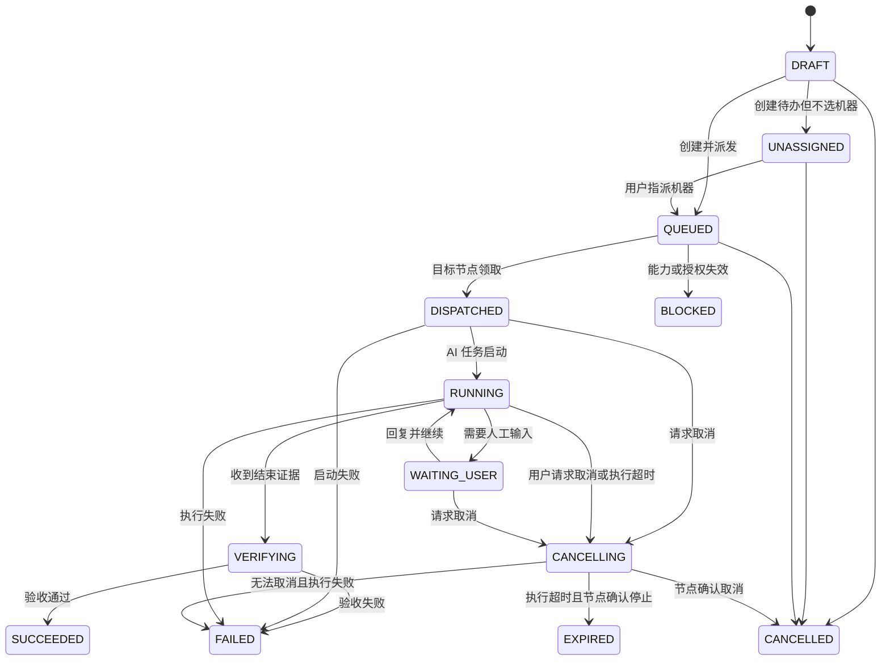

# 中央待办与单机执行产品设计

> 文档版本：v0.1
>
> 设计日期：2026-08-31
>
> 适用范围：AI 任务中控台 `0.3.x` 规划
>
> 状态：已完成产品与技术设计，尚未实现

## 1. 设计结论

AI 任务中控台新增独立的“待办”模块。用户可以先创建待办而不选择机器，也可以显式选择一台已配对机器、一个 AI 工具和一个已授权工作区，由该机器排队并执行。

首版采用以下默认决策：

- 新建待办默认不指派机器；未指派时进入 `UNASSIGNED`，不会被任何节点自动领取；
- 需要执行时，一个待办一次只能指派给一台机器；
- 机器离线时允许创建，待办保持排队，机器重连后再领取；
- 不自动把待办转移到其他机器，改派必须由用户明确操作；
- 待办与 AI 任务记录分离：待办表达“要做什么”，AI 任务记录表达“一次实际执行”；
- 一个待办可以因重试或改派产生多个执行尝试，但同一时刻最多一个有效尝试；
- 默认要求达到 `E2` 厂商结构化结束证据，只有 AI 窗口空闲或进程消失不能判定成功；
- 中央服务只下发结构化任务，不允许下发任意 Shell、环境变量或本机绝对路径；
- 本机只能执行预先注册并授权的工作区和验证器；
- 执行超时默认 1 小时，可选择 1、2 或 3 小时；从 AI 任务真正进入 `RUNNING` 时开始计时，等待分配和设备离线排队不消耗执行时间。

## 2. 当前能力与缺口

当前系统已能从多台机器汇总正在执行的 AI 任务，并向已有会话发送 `SEND_NEXT`、`RESUME_AND_SEND`、`OPEN_AND_PREFILL` 命令。

新增待办需要补齐另一条链路：

```text
创建待办
  → 指派设备、工具、工作区
  → 目标节点领取任务
  → 节点启动一个新的托管 AI 任务
  → 持续上报进度和等待用户状态
  → 收集结束与验收证据
  → 中央控制台判定成功或失败
```

现有命令只会继续一个已知会话，不能可靠地启动全新的后台任务。因此必须新增 `START_TASK` 能力，而不是复用“给已有任务发下一步”。

## 3. 产品目标与非目标

### 3.1 目标

- 在桌面端和手机端快速查看全部待办；
- 创建待办时可以暂不选择机器，也可以明确选择一台机器执行；
- 看清待办是在中央队列、目标机器还是 AI 工具中；
- 机器掉线、应用退出、重复投递时不丢任务、不重复执行；
- 对等待用户、失败、超时和完成进行通知；
- 每次创建、指派、执行、改派和验收都有审计记录；
- 从待办直接跳转到执行它的设备和 AI 任务详情。

### 3.2 首版非目标

- 不做多机并行执行同一个待办；
- 不自动选择、自动分配或自动改派机器；
- 不支持由中央服务执行任意脚本；
- 不做复杂的任务依赖、定时工作流和跨 Agent 编排；
- 不把“AI 自述完成”直接当作业务验收完成；
- 不通过不可审计的键鼠模拟，在 Cursor 桌面端静默创建新会话。

## 4. 核心对象

| 对象 | 含义 | 生命周期 |
|---|---|---|
| 待办 `Todo` | 用户要完成的工作，包含标题、指令、验收要求和目标机器 | 从创建到成功、取消或过期 |
| 执行尝试 `TodoAttempt` | 某台机器对待办的一次实际尝试 | 每次执行、重试或改派各生成一条 |
| AI 任务 `TaskRecord` | Codex、Claude、Cursor 或 Antigravity 的实际会话/回合 | 由节点启动后关联到执行尝试 |
| 工作区档案 `WorkspaceProfile` | 本机声明并授权的安全工作区别名 | 由节点维护并同步能力，不暴露任意路径 |
| 待办事件 `TodoEvent` | 创建、派发、进度、完成、失败和人工操作的时间线 | 只追加，不覆盖 |

关系如下：

```text
Todo 1 ─── N TodoAttempt N ─── 1 Device
                   │
                   └── 0..1 TaskRecord
```

## 5. 信息架构

主导航增加“待办”，并在“设备”和“总览”中增加待办摘要。

| 页面 | 主要内容 | 主要操作 |
|---|---|---|
| 总览 | 待分配、排队中、执行中、等待我、失败、今日完成 | 查看异常、进入待办详情 |
| 待办 | 列表/看板、搜索、设备与状态筛选 | 新建、取消、重试、改派 |
| 待办详情 | 指令、验收标准、目标设备、执行时间线、证据 | 取消、重试、改派、打开关联任务 |
| 设备详情 | 能力、工作区、在线状态、队列与运行数量 | 查看该机器待办、暂停领取 |
| 新建待办 | 四步创建流程 | 保存草稿、创建并派发 |

移动端底部导航建议为“总览 / 待办 / 设备 / 我的”，把高频的“等待我处理”放在总览首屏。

## 6. 界面设计

### 6.1 桌面端待办页

```text
┌────────────────────────────────────────────────────────────────────┐
│ 待办                                               ＋ 新建待办     │
│ [待分配 3] [排队中 3] [执行中 2] [等待我 1] [失败 1]             │
│                                                                    │
│ 搜索...  状态▼  机器▼  AI工具▼  优先级▼    列表 / 看板            │
├────────────────────────────────────────────────────────────────────┤
│ P1  修复登录超时                         执行中  12 分钟           │
│     MacBook-Pro · Codex · enterprise          查看实时任务 →       │
│     验收：测试通过；无 P0/P1 回归                                  │
├────────────────────────────────────────────────────────────────────┤
│ P2  整理安装文档                         等待设备上线               │
│     Windows-Office · Claude · rpa             已排队 18 分钟        │
├────────────────────────────────────────────────────────────────────┤
│ P1  分析支付失败                         等待我                     │
│     Mac-mini · Antigravity                [查看问题] [回复并继续]    │
└────────────────────────────────────────────────────────────────────┘
```

交互规则：

- 默认按“需要用户介入 > 待分配 > 优先级 > 创建时间”排序；
- 卡片必须同时显示待办状态、机器状态和 AI 工具，避免把“已排队”误读为“正在执行”；
- 失败卡片直接显示简短错误原因，不在列表展示原始提示词；
- “执行中”可跳转到关联 AI 任务；“等待设备上线”可改派或取消；
- 列表和看板共享筛选条件，URL 保存筛选状态。

### 6.2 新建待办

采用四步抽屉；桌面宽度建议 640 px，移动端为全屏页面。

#### 第一步：任务内容

- 标题：必填，1–120 字；
- 详细指令：必填，最多 32 KiB；
- 优先级：`P0 / P1 / P2 / P3`，默认 `P2`；
- 截止时间：选填；
- 附件：首版仅支持中央服务已安全存储的引用，不直接发送本机路径。

#### 第二步：选择执行机器

设备卡片显示：

- 设备别名和操作系统；
- 在线、离线、已撤销或暂停领取；
- 当前运行数、排队数；
- 已安装且可启动的 AI 工具；
- 最后在线时间。

第一项为默认选中的“暂不指定机器”，其后是可选择的设备列表。机器是选填项，但选择时只允许单选：

- 选择“暂不指定机器”时，创建后进入 `UNASSIGNED`，不进入任何设备队列；
- 后续在待办详情点击“指派机器”，再选择机器、AI 工具和工作区；
- 离线设备可以选择，但提交前显示二次提示：“任务将在该设备重新上线后执行，不会自动转移到其他设备。”；
- 已撤销或能力不匹配的设备不可选；
- 系统可以显示推荐机器，但不得在用户未确认时自动指派。

#### 第三步：执行配置

- AI 工具：从所选机器上报的可用工具中单选；
- 工作区：从该机器的授权工作区别名中单选；
- 执行方式：首版固定为“创建新的托管任务”；
- 执行超时：默认 1 小时，可选 1 小时、2 小时、3 小时；AI 任务进入 `RUNNING` 后开始计时；
- 验收证据：默认 `E2`，存在已授权验证器时可选 `E3`。

未选择机器时，AI 工具和工作区显示“指派机器时选择”并禁用；执行超时和验收条件仍可提前设置。

不提供自由输入的可执行文件、Shell、环境变量和任意绝对路径。

#### 第四步：验收与确认

- 结构化验收项，每项包含描述和是否必须；
- 展示最终目标机器、工具、工作区、超时和离线排队提示；
- 已选择机器时操作为“保存草稿”和“创建并派发”；未选择机器时操作为“保存草稿”和“创建待办”。

### 6.3 移动端

```text
┌──────────────────────┐
│ 待办             ＋  │
│ [待分配3] [排队中3]  │
│ [执行中2] [等待我1]  │
│                      │
│ P1 修复登录超时      │
│ 执行中 · 12 分钟     │
│ MacBook · Codex      │
│ 查看实时任务       > │
│                      │
│ P2 整理安装文档      │
│ 等待设备上线         │
│ Windows · Claude     │
│ 改派   取消          │
├──────────────────────┤
│ 总览  待办  设备  我的│
└──────────────────────┘
```

- 关键按钮触控区域不小于 44×44 px；
- 创建过程每屏只处理一个决策，选择结果固定显示在底部提交区上方；
- 时间使用相对时间并可展开查看绝对时间；
- 弱网提交使用幂等键，避免连续点击产生重复待办。

### 6.4 待办详情

详情页从上到下为：

1. 标题、优先级、当前状态和截止时间；
2. 目标机器、AI 工具、工作区和在线状态；
3. 指令与验收清单；
4. 当前执行尝试和关联 AI 任务；
5. 完成证据、失败原因或等待用户的问题；
6. 按时间倒序的审计时间线；
7. 取消、回复并继续、重试、改派等上下文操作。

危险操作必须二次确认。改派会终止或废弃当前尝试，创建新的尝试，不修改历史记录。

## 7. 状态模型

### 7.1 待办状态

| 状态 | 含义 | 用户可执行操作 |
|---|---|---|
| `DRAFT` | 尚未派发的草稿 | 编辑、删除、派发 |
| `UNASSIGNED` | 已创建但尚未指定执行机器 | 编辑、指派、取消 |
| `QUEUED` | 已绑定机器，等待领取或等待执行槽 | 取消、改派 |
| `DISPATCHED` | 目标节点已确认领取 | 取消 |
| `RUNNING` | AI 工具正在执行 | 查看任务、请求取消 |
| `WAITING_USER` | AI 需要授权、答案或人工操作 | 回复并继续、取消 |
| `VERIFYING` | AI 已结束，系统正在核验结果 | 查看证据 |
| `CANCELLING` | 已请求目标节点取消，等待确认 | 查看当前状态 |
| `SUCCEEDED` | 验收证据满足要求 | 查看结果、重新执行 |
| `FAILED` | 启动、执行或验收失败 | 查看原因、重试、改派 |
| `BLOCKED` | 依赖、权限或能力不满足 | 处理阻塞、重试、改派 |
| `CANCELLED` | 已取消 | 重新执行 |
| `EXPIRED` | 执行超过选定时长，且节点已确认停止 | 重新执行 |



取消正在运行的任务属于“请求—确认”过程。节点尚未确认停止前，界面显示“正在取消”，不能立即伪装成 `CANCELLED`。

执行超时使用服务端单调计时语义：从第一次进入 `RUNNING` 开始，到进入 `VERIFYING` 或终态时停止；`WAITING_USER` 期间继续计时。未分配、排队和节点启动阶段不计入 1/2/3 小时执行时长。

### 7.2 执行尝试状态

执行尝试使用更细的内部状态：

```text
CREATED → OFFERED → LEASED → STARTING → RUNNING
                                      ↘ WAITING_USER
RUNNING → RESULT_REPORTED → VERIFIED → SUCCEEDED
任意非终态 → FAILED / CANCELLED / EXPIRED / ABANDONED
```

数据库约束保证一个待办最多只有一个 `OFFERED`、`LEASED`、`STARTING`、`RUNNING`、`WAITING_USER` 或 `CANCELLING` 的活动尝试。

## 8. 调度与离线规则

### 8.1 设备队列

- 每台机器默认一个执行槽，避免多个 AI 工具争抢 CPU、内存和工作区；
- `UNASSIGNED` 待办只存在中央列表中，不属于任何设备队列；
- 队列按优先级和创建时间排序，并对长时间等待任务做年龄提升，避免低优先级永久饥饿；
- 节点可以“暂停领取新待办”，但不会中断已经运行的任务；
- 中央服务保留排队事实，节点只缓存已领取尝试和幂等账本。

### 8.2 租约与幂等

- 每个执行尝试具有不可复用的 `attemptId`；
- 节点领取后获得 90 秒租约，执行中每 30 秒续租；
- 节点本地记录已处理 `attemptId`，重复收到同一任务只返回当前状态，不再次启动；
- 节点掉线后中央服务等待租约到期，但不会在另一台机器执行；
- 原目标机器重连后可继续上报；状态冲突交由版本号和服务端事件序列仲裁；
- 自动重试仅用于传输和短暂启动故障，最多 3 次；AI 执行失败不会静默重新运行。

### 8.3 改派

用户改派时：

1. 对旧尝试发出取消请求；
2. 旧尝试标记为 `ABANDONED` 或在确认后标记 `CANCELLED`；
3. 为新机器创建新的 `attemptId`；
4. 保留两个尝试的完整时间线；
5. 如果旧机器后来上报成功，不覆盖当前尝试，只标记为迟到结果并告警。

## 9. AI 工具执行策略

| 工具 | 首版启动策略 | 自动化级别 | 限制 |
|---|---|---|---|
| Codex | 节点通过受控 CLI/App Server 创建托管任务 | 高 | 仅允许已授权工作区和配置 |
| Claude | 节点通过受控 CLI/SDK 创建托管会话 | 高 | 权限提示必须进入 `WAITING_USER` |
| Antigravity | 使用 headless/stream-json 托管会话 | 实验性 | 需先验证当前版本的稳定协议 |
| Cursor | 优先 Cursor Cloud Agent；本地桌面端降级为打开并预填 | 中/低 | 本地 GUI 不承诺无人值守创建任务 |

工具适配器统一实现：

```rust
trait ManagedTaskAdapter {
    async fn start(&self, request: StartTaskRequest) -> Result<ManagedSession>;
    async fn send_input(&self, session: &ManagedSession, text: SecretText) -> Result<()>;
    async fn cancel(&self, session: &ManagedSession) -> Result<CancelOutcome>;
    async fn inspect(&self, session: &ManagedSession) -> Result<ExecutionSnapshot>;
}
```

适配器必须返回结构化状态，不解析 AI 自然语言中的“完成了”作为最终结果。

## 10. 数据模型

### 10.1 `todos`

| 字段 | 类型 | 说明 |
|---|---|---|
| `id` | UUID | 待办 ID |
| `tenant_id` | UUID | 租户边界；个人版使用默认租户 |
| `title` | varchar(120) | 标题 |
| `description_ciphertext` | bytea/text | 加密后的详细指令 |
| `priority` | enum | `P0`–`P3` |
| `status` | enum | 待办状态 |
| `target_device_id` | UUID/null | 当前指定机器；未指派时为空 |
| `target_provider` | enum/null | AI 工具；未指派机器时为空 |
| `workspace_ref` | varchar/null | 设备发布的安全工作区别名；未指派机器时为空 |
| `acceptance_criteria` | jsonb | 结构化验收项 |
| `required_evidence_level` | enum | 默认 `E2` |
| `due_at` | timestamptz | 业务截止时间，可空 |
| `execution_timeout_seconds` | integer | 允许 3600、7200、10800，默认 3600；从 `RUNNING` 开始计时 |
| `created_by` | UUID | 创建人 |
| `version` | bigint | 乐观锁版本 |
| `created_at/updated_at` | timestamptz | 审计时间 |

### 10.2 `todo_attempts`

主要字段：`id`、`todo_id`、`attempt_no`、`device_id`、`provider`、`workspace_ref`、`state`、`lease_owner`、`lease_until`、`task_id`、`provider_session_id_ciphertext`、`started_at`、`finished_at`、`result_summary`、`evidence_level`、`error_code`、`error_summary`。

### 10.3 `todo_events`

事件只追加，至少保存：事件 ID、待办 ID、尝试 ID、事件类型、来源、操作者、服务端接收时间、节点发生时间、脱敏后的元数据和前一事件哈希。

### 10.4 `workspace_profiles`

工作区由节点本地注册，中央服务只保存别名与能力摘要：`device_id`、`workspace_ref`、`display_name`、`allowed_providers`、`allowed_verifier_refs`、`enabled`、`capability_version`。真实路径保留在本机加密配置中。

## 11. API 与节点协议

### 11.1 控制台 API

```http
GET    /api/todos
POST   /api/todos
GET    /api/todos/{todoId}
PATCH  /api/todos/{todoId}
DELETE /api/todos/{todoId}              # 仅草稿，服务端软删除并保留审计
POST   /api/todos/{todoId}/dispatch
POST   /api/todos/{todoId}/assign       # 为 UNASSIGNED 待办选择机器、工具和工作区
POST   /api/todos/{todoId}/cancel
POST   /api/todos/{todoId}/input        # WAITING_USER 时回复并继续
POST   /api/todos/{todoId}/retry
POST   /api/todos/{todoId}/reassign
GET    /api/todos/{todoId}/attempts
GET    /api/devices/{deviceId}/execution-capabilities
```

所有写接口要求 `Idempotency-Key`。`targetDeviceId`、`provider` 和 `workspaceRef` 在创建时可以同时省略；三者必须同时提供或同时省略。`retry` 和 `reassign` 永远创建新尝试，不复用旧 `attemptId`。

示例创建请求：

```json
{
  "title": "完善安装手册",
  "description": "检查 macOS 和 Windows 安装步骤并补齐验证命令。",
  "priority": "P2",
  "targetDeviceId": "019...",
  "provider": "CODEX",
  "workspaceRef": "rpa-main",
  "requiredEvidenceLevel": "E2",
  "acceptanceCriteria": [
    { "text": "两套安装流程均有可复制命令", "required": true },
    { "text": "文档链接和健康检查通过", "required": true }
  ],
  "executionTimeoutSeconds": 3600
}
```

不指定机器时省略 `targetDeviceId`、`provider` 和 `workspaceRef`，创建结果为 `UNASSIGNED`；在调用 `assign` 前不会生成 `TodoAttempt`，也不会向节点发送消息。

### 11.2 WSS 节点消息

沿用设备绑定令牌和 `/v1/nodes/connect`，新增消息：

| 消息 | 方向 | 用途 |
|---|---|---|
| `TODO_OFFER` | 服务端 → 节点 | 提供一个结构化执行尝试 |
| `TODO_ACK` | 节点 → 服务端 | 接受、拒绝或返回重复执行状态 |
| `TODO_PROGRESS` | 节点 → 服务端 | 上报启动、运行、等待用户和验证进度 |
| `TODO_RESULT` | 节点 → 服务端 | 上报结构化结果、证据摘要和错误码 |
| `TODO_CANCEL` | 服务端 → 节点 | 请求取消当前尝试 |
| `TODO_CANCEL_ACK` | 节点 → 服务端 | 确认已停止、无法停止或已经结束 |

`TODO_OFFER` 只包含 `todoId`、`attemptId`、工具、`workspaceRef`、加密指令、结构化验收项、证据要求、执行超时和消息有效期，不包含 Shell 命令。

## 12. 完成判定

延续现有证据等级：

- `E0`：只检测到窗口或进程；不能判定执行中或完成；
- `E1`：观测到任务生命周期结束；只能进入 `VERIFYING`；
- `E2`：厂商 Hook、CLI 或 API 返回结构化成功结果；默认可判成功；
- `E3`：本机已授权验证器给出通过结果，如测试、构建、产物哈希或受控业务读回。

判定规则：

```text
实际证据等级 >= 待办要求
AND 所有 required 验收项通过
AND 无未处理的安全/权限失败
AND 当前尝试仍是该待办的活动尝试
= SUCCEEDED
```

AI 回复“已经完成”、窗口关闭、进程退出、长时间无输出都不能单独满足上述条件。无验证器但要求 `E3` 时进入 `BLOCKED`，提示用户调整要求或配置验证器，不得降级为成功。

## 13. 安全与权限

- 中央数据库中的详细指令、会话 ID 和敏感结果加密存储；
- Web/API 使用用户身份校验，节点协议使用设备绑定令牌；
- 服务端校验待办租户、目标设备、工具能力和工作区授权；
- 节点再次校验 `workspaceRef`，拒绝未知、禁用或路径逃逸；
- 不允许任务内容改变节点策略、自动批准危险权限或读取未授权目录；
- 日志不记录完整提示词、令牌、本机绝对路径和模型原始输出；
- 已撤销设备不能领取、续租或上报有效结果；
- 用户创建、取消、重试、改派及系统判定均写入审计事件；
- 执行器以普通用户权限运行，不获取管理员权限；
- 未来团队版按租户、角色和设备组控制“查看、创建、派发、取消、审计”权限。

## 14. 通知策略

| 事件 | 默认通知 | 内容 |
|---|---|---|
| `WAITING_USER` | 立即 | 待办名、机器、工具、问题摘要、处理入口 |
| `FAILED/BLOCKED` | 立即 | 待办名、机器、错误分类、重试/改派入口 |
| 即将超期/已超期 | 立即 | 截止时间、当前队列位置或阻塞原因 |
| `SUCCEEDED` | 汇总，可配置立即 | 待办名、机器、耗时、证据等级 |
| `RUNNING` | 默认不通知 | 控制台内实时更新 |

飞书通知不包含完整任务指令和敏感输出。移动端深链直接打开待办详情。

## 15. 可观测性

核心指标：

- 每台设备排队数、运行数、平均等待时间；
- 待办创建到领取、领取到启动、启动到完成的耗时；
- 投递重试率、重复消息率、租约过期率；
- 各工具启动成功率和 E2/E3 验收通过率；
- 等待用户时长、失败分类、改派次数；
- 迟到结果和同一待办并发尝试冲突数。

每个待办、尝试、节点连接和 AI 任务使用可串联的 trace ID，方便定位“中央服务显示排队，但机器没有执行”一类问题。

## 16. 测试与验收设计

### 16.1 功能用例

| 编号 | 场景 | 预期 |
|---|---|---|
| TODO-F-001 | 创建并指派在线机器 | 目标机器领取且仅启动一次 |
| TODO-F-002 | 创建并指派离线机器 | 保持 `QUEUED`，重连后执行 |
| TODO-F-003 | 创建时不选择机器 | 创建为 `UNASSIGNED`，不生成执行尝试、不向节点投递 |
| TODO-F-004 | 工作区不在授权列表 | 服务端/节点拒绝，进入 `BLOCKED` |
| TODO-F-005 | 机器暂停领取 | 新待办排队，已有任务不受影响 |
| TODO-F-006 | 执行中要求用户输入 | 进入 `WAITING_USER`，回复后回到 `RUNNING` |
| TODO-F-007 | 用户取消排队任务 | 不下发，状态为 `CANCELLED` |
| TODO-F-008 | 用户取消运行任务 | 显示正在取消，节点确认后终止 |
| TODO-F-009 | 重试失败任务 | 新建 attempt，旧记录保留 |
| TODO-F-010 | 改派另一机器 | 旧 attempt 废弃，新机器领取新 attempt |
| TODO-F-011 | 达到 E2 且验收项通过 | `VERIFYING` 后转 `SUCCEEDED` |
| TODO-F-012 | 只有 E1 但要求 E2 | 不能成功，验证宽限期后进入 `BLOCKED/INSUFFICIENT_EVIDENCE` |
| TODO-F-013 | 选机器但缺少工具或工作区 | 前后端拒绝派发，允许改为暂不指定机器 |
| TODO-F-014 | 选择 1/2/3 小时执行超时 | 从 `RUNNING` 开始按所选时长计时 |
| TODO-F-015 | 未指派或离线排队超过 1 小时 | 不触发执行超时，仍为 `UNASSIGNED/QUEUED` |

### 16.2 可靠性用例

- 同一 `TODO_OFFER` 重复 100 次，只启动一次；
- 节点领取后断网，恢复后不创建第二个会话；
- 服务端重启、WebSocket 重连后队列和租约可恢复；
- 旧机器在改派后迟到上报成功，不覆盖新尝试；
- 客户端连续点击“创建并派发”，幂等键只生成一个待办；
- 节点时钟偏差 10 分钟时，以服务端时间正确处理租约；
- 1 万条历史待办下，首屏筛选和分页响应仍满足性能目标。

### 16.3 安全用例

- 伪造其他设备 ID、租户 ID 或 `attemptId` 被拒绝；
- 已撤销设备不能领取和续租；
- `../`、符号链接逃逸、未知 `workspaceRef` 被拒绝；
- 指令中的 Shell、路径和环境变量内容只作为 AI 文本，不能改变执行器参数；
- API、日志、通知和浏览器缓存中不出现明文密钥与完整敏感指令；
- 无验证器时不能伪造 `E3`；
- 执行器权限提示不会自动批准，任务进入 `WAITING_USER`。

### 16.4 跨端体验用例

- macOS、Windows Native 各完成一次在线与离线领取；
- Windows Native 与 WSL 作为两个逻辑设备分别指派；
- 桌面端 1280×720、1440×900；
- 移动端 390×844 和 360×800；
- 弱网、断网重试、前后台切换不重复创建；
- 键盘操作、焦点顺序、错误提示和颜色对比度符合可访问性要求。

## 17. 首版验收标准

首版只有同时满足以下条件才可声明“待办可由一台机器执行”：

1. Web 和移动响应式界面可以创建、筛选、查看、取消、重试和改派待办；
2. 不选机器可创建 `UNASSIGNED` 待办，后续人工指派后才进入设备队列；
3. 在线和离线目标机器均能正确排队，且绝不自动分配或转移机器；
4. 执行超时默认 1 小时，可选 1/2/3 小时，且只从 `RUNNING` 开始计时；
5. macOS 与 Windows 各有至少一个工具完成 E2 级真实闭环；
6. 重复投递、断线重连和服务重启不导致重复启动；
7. 可以从待办详情查看关联机器、AI 任务、尝试历史和完成证据；
8. `WAITING_USER`、失败、阻塞和超期通知可到达；
9. 未授权工作区、已撤销设备和伪造目标均被拒绝；
10. 自动化测试、真机测试和故障注入均有可审计记录。

Cursor 本地桌面端如果只能“打开并预填”，必须在 UI 明确标记为“需要人工确认”，不能计入无人值守闭环。

## 18. 实施阶段

| 阶段 | 范围 | 退出条件 |
|---|---|---|
| M1：待办管理 | 数据表、API、列表/详情/创建、设备能力选择 | 可创建并指派，但明确标记尚未执行 |
| M2：单机执行 | WSS 协议、节点租约、幂等账本、Codex/Claude 启动适配器 | macOS/Windows 完成 E2 闭环 |
| M3：可靠验收 | E3 验证器、取消、重试、改派、通知、故障恢复 | 可靠性与安全用例通过 |
| M4：工具扩展 | Cursor Cloud、Antigravity、计划任务和模板 | 适配器验收矩阵通过 |

建议优先实现 Codex 和 Claude，随后接入 Antigravity；Cursor 本地桌面能力保留人工确认降级，Cursor Cloud Agent 配置完成后再提供无人值守模式。

## 19. 后续增强

- 按设备空闲度给出推荐机器，但仍由用户确认；
- 待办模板、周期任务、依赖关系和批量派发；
- 同一待办的多机竞赛或分片执行；
- 团队、设备组、RBAC 和审批策略；
- 成本预算、模型策略和并发配额；
- 飞书交互卡片直接回复并继续；
- iOS/Android 原生推送和移动端快捷创建。
